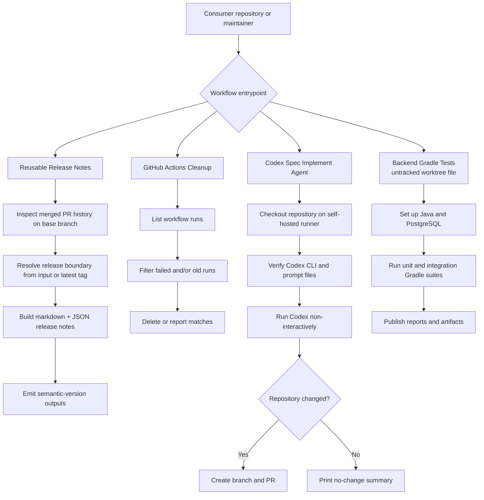
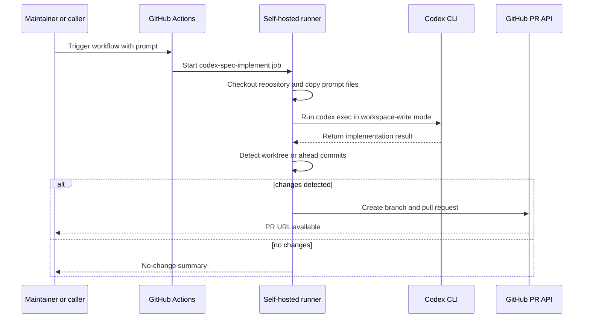

# elegant-ci-cd-pipeline

Reusable GitHub Actions workflow repository for CI/CD automation, release-note generation, repository maintenance, and Spec Kit driven planning.

The current `main` branch contains three tracked workflows under `.github/workflows/`:

- `reusable-release-notes.yml`
- `github-actions-cleanup.yml`
- `codex-spec-implementation-agent.yml`

The current worktree also contains an untracked reusable workflow, `back-end-gradle-test.yml`, which appears to be in progress and is documented separately below as pending worktree state rather than confirmed `main` branch history.

## Repository Layout

```text
.github/workflows/   reusable workflow entrypoints
.specify/            Spec Kit scripts and templates
docs/                operator-facing workflow documentation
specs/               feature specs, plans, and tasks
tests/contract/      workflow interface and output expectations
tests/integration/   end-to-end scenario documentation
```

## Pipeline Overview

This repository acts as a reusable automation catalog. Other repositories can call these workflows with `workflow_call`, while repository maintainers can also run some of them manually with `workflow_dispatch`.



## Workflow Inventory

### 1. Reusable Release Notes

File: `.github/workflows/reusable-release-notes.yml`

Purpose:

- collects merged pull requests on the configured base branch
- resolves a release boundary from an explicit input or the latest reachable tag
- groups pull requests into release-note sections from labels
- computes the highest required semantic version bump
- exposes markdown, JSON, and release decision outputs for downstream jobs

Triggers:

- `workflow_call`
- `workflow_dispatch`
- `pull_request` closed on `main`

Inputs:

| Input | Description | Required | Default |
| --- | --- | --- | --- |
| `base_branch` | Primary branch used to collect merged pull requests. | No | `main` |
| `release_boundary` | Explicit release tag or ref used as the lower bound for eligible pull requests. | No | `""` |
| `category_rules` | JSON object mapping release-note section names to labels. | No | Built-in category mapping |
| `version_rules` | JSON object mapping semantic version levels to labels. | No | Built-in semver mapping |
| `unlabeled_behavior` | Policy for pull requests with no recognized version metadata. | No | `include_as_patch` |
| `revert_handling` | Policy for reverted pull requests. | No | `exclude_reverted` |
| `include_pr_links` | Include pull request links in markdown output. | No | `true` |
| `include_authors` | Include author names in markdown output. | No | `true` |

Outputs:

| Output | Description | Required |
| --- | --- | --- |
| `release_required` | Whether any releasable changes remain after filtering. | No |
| `version_bump` | Selected semantic version bump. | No |
| `next_version` | Next resolved version string. | No |
| `release_notes_markdown` | Human-readable release notes. | No |
| `release_notes_json` | Structured release note payload. | No |
| `included_pr_count` | Number of included pull requests. | No |
| `excluded_prs_with_reasons` | Structured excluded pull request list. | No |
| `decision_reason` | Human-readable explanation of the release decision. | No |

```mermaid
flowchart LR
    A[Trigger: workflow_call / workflow_dispatch / PR closed on main] --> B[Checkout repo with full history]
    B --> C[Fetch tags and base branch]
    C --> D[Resolve release boundary]
    D --> E[Collect merged PR candidates]
    E --> F[Apply category rules]
    F --> G[Apply semver rules]
    G --> H[Exclude reverted or invalid PRs]
    H --> I[Build markdown and JSON outputs]
    I --> J[Publish release decision outputs]
```



### 2. GitHub Actions Cleanup

File: `.github/workflows/github-actions-cleanup.yml`

Purpose:

- scans workflow runs for the repository or a specific workflow file
- filters by failed conclusion and/or age threshold
- deletes matching runs or reports them in `dry_run` mode

Triggers:

- `workflow_dispatch`
- `workflow_call`

Inputs:

| Input | Description | Required | Default |
| --- | --- | --- | --- |
| `workflow_file` | Workflow file name to clean; blank means all workflows. | No | `""` |
| `delete_failed` | Delete failed runs. | No for `workflow_call`; Yes for `workflow_dispatch` | `true` |
| `older_than_days` | Delete runs older than this many days; `0` disables age-based deletion. | No for `workflow_call`; Yes for `workflow_dispatch` | `14` |
| `dry_run` | Only report what would be deleted. | No for `workflow_call`; Yes for `workflow_dispatch` | `false` |

Outputs:

| Output | Description | Required |
| --- | --- | --- |
| None declared | This workflow prints summary values during execution, but does not declare `workflow_call` outputs. | No |

### 3. Codex Spec Implement Agent

File: `.github/workflows/codex-spec-implementation-agent.yml`

Purpose:

- runs Codex CLI on a self-hosted runner
- copies repository prompt files into `CODEX_HOME`
- executes a non-interactive Spec Kit implementation prompt
- detects resulting changes and opens a pull request automatically

Triggers:

- `workflow_dispatch`
- `workflow_call`

Inputs:

| Input | Description | Required | Default |
| --- | --- | --- | --- |
| `prompt` | Prompt sent to Codex CLI. | No | `/prompts.speckit.implement 004 do not ask question and decide yourself session should be non-interactive and commands are allowed` |

Outputs:

| Output | Description | Required |
| --- | --- | --- |
| None declared | This workflow reports results in job logs and PR creation steps, but does not declare `workflow_call` outputs. | No |



### 4. Backend Gradle Tests

File in current worktree: `.github/workflows/back-end-gradle-test.yml`

Status:

- present in the current working tree
- currently untracked by git, so not part of committed `main` branch history yet

Observed behavior:

- exposes a reusable `workflow_call` interface
- provisions PostgreSQL as a service container
- sets up Java with Gradle cache
- runs unit and integration Gradle tasks independently
- publishes JUnit summaries and uploads test artifacts
- fails the job if any enabled suite fails

Inputs:

| Input | Description | Required | Default |
| --- | --- | --- | --- |
| `java-version` | JDK version used for the Gradle build. | No | `21` |
| `java-distribution` | JDK distribution used for the Gradle build. | No | `temurin` |
| `gradle-wrapper` | Path to the Gradle wrapper script. | No | `./gradlew` |
| `gradle-args` | Additional Gradle arguments appended to each test command. | No | `""` |
| `run-unit-tests` | Whether to execute the unit test suite. | No | `true` |
| `unit-test-task` | Gradle task used for the unit test suite. | No | `test` |
| `unit-test-results-path` | Glob for unit test JUnit XML results. | No | `**/build/test-results/test/TEST-*.xml` |
| `unit-test-report-path` | Glob for unit test HTML reports. | No | `**/build/reports/tests/test/**` |
| `run-integration-tests` | Whether to execute the integration test suite. | No | `true` |
| `integration-test-task` | Gradle task used for the integration test suite. | No | `integrationTest` |
| `integration-test-results-path` | Glob for integration test JUnit XML results. | No | `**/build/test-results/integrationTest/TEST-*.xml` |
| `integration-test-report-path` | Glob for integration test HTML reports. | No | `**/build/reports/tests/integrationTest/**` |
| `postgres-db` | PostgreSQL database name used by the tests. | No | `quickpay_db` |
| `postgres-user` | PostgreSQL username used by the tests. | No | `postgres` |
| `postgres-password` | PostgreSQL password used by the tests. | No | `postgres` |

Outputs:

| Output | Description | Required |
| --- | --- | --- |
| None declared | This workflow publishes reports and artifacts, but does not declare `workflow_call` outputs. | No |

## How To Use This Repository

Typical usage from another repository:

```yaml
jobs:
  release_notes:
    uses: your-org/elegant-ci-cd-pipeline/.github/workflows/release-notes.yml@main
    with:
      base_branch: main

  cleanup:
    uses: your-org/elegant-ci-cd-pipeline/.github/workflows/github-actions-cleanup.yml@main
    with:
      dry_run: true
```

## Related Documentation

- [CONTRIBUTING.md](./CONTRIBUTING.md) for repository architecture and commit rules
- [docs/reusable-release-notes.md](./docs/reusable-release-notes.md) for release-note workflow behavior
- [docs/release-policy.md](./docs/release-policy.md) for semantic version and labeling policy
